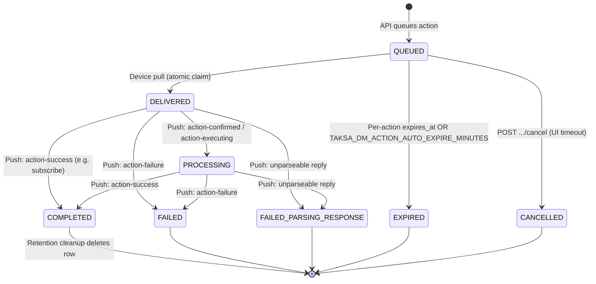

# Action Management in Device Management (DM)

This document describes how DM queues work for edge devices (DCD / umh-core), how actions change state, and how expiry, cancellation, and cleanup behave.

**Related:** [ENUM_REFERENCE.md](./ENUM_REFERENCE.md) (status integer values), [Bruno cancel tests](../bruno/01-DeviceActions/README-DeviceActions-API-Testing.md).

---

## Overview

Management APIs (northbound) **queue** actions in PostgreSQL. Edge devices (southbound) **pull** actions via `/v2/instance/pull` and **push** replies via `/v2/instance/push`. The UI polls `GetXActionResponse` endpoints until the action reaches a terminal status.

There are two paths into the system:

| Path | Who | Entry |
|------|-----|--------|
| **Queue** | Console / API | `GetDeviceConfig`, `DeployProtocolConverter`, etc. → `ActionQueuedResponse` |
| **Pull** | Edge device | JWT cookie → pending actions as UMH messages |
| **Push** | Edge device | Action replies, status messages, logs payloads |

---

## Action status state machine



### Status reference

| Status | Code | Set by | Notes |
|--------|------|--------|-------|
| `QUEUED` | 1 | Queue API | Waiting for device pull |
| `DELIVERED` | 2 | Pull (claim) | Atomically claimed; message returned to device |
| `PROCESSING` | 3 | Push | Intermediate `action-confirmed` / `action-executing` |
| `COMPLETED` | 4 | Push | Terminal success |
| `FAILED` | 5 | Push | Terminal failure (`error_message` populated) |
| `EXPIRED` | 6 | TTL / auto-expire | Terminal; device must not receive |
| `CANCELLED` | 7 | Cancel API | Terminal; UI/user abort |
| `FAILED_PARSING_RESPONSE` | 8 | Push | Terminal; reply could not be parsed |

### Rules

- **Only `QUEUED`** may become `CANCELLED` or `EXPIRED` (via auto-expire sweep).
- **`DELIVERED` / `PROCESSING`** complete only through device push (`COMPLETED` / `FAILED` / `FAILED_PARSING_RESPONSE`).
- **DCDs never receive** `CANCELLED` or `EXPIRED` actions — pull uses an atomic claim (`UPDATE … WHERE status = QUEUED`).
- **Push replies are ignored** for actions already `CANCELLED` or `EXPIRED` (late stray replies do not overwrite terminal state).

---

## Pull: claim-on-deliver (race-safe)

Previous pattern (`ListPending` then `MarkDelivered`) allowed a cancel to land between list and deliver. Pull now:

1. **`ClaimQueuedForDevice`** — single SQL `UPDATE … SET status = DELIVERED WHERE status = QUEUED … RETURNING`, ordered by `created_at ASC`.
   Rows with `expires_at < now` are **not claimed** (left `QUEUED` until the cleanup loop marks them `EXPIRED`).

If cancel or auto-expire wins the race, the row is no longer `QUEUED` and is **not** returned to the device.

**Subscribe actions** are special: after claim they are immediately marked `COMPLETED` on pull (edge handles subscribe without action-reply).

Implementation: `InstanceUsecase.PullMessages` in `internal/biz/instance.go`, storage in `internal/storage/postgres/action.go`.

---

## Push: correlating replies

Device replies include:

- **`metadata.traceId`** (primary) — stored in `action_message_tracking` at pull time.
- **`Payload.actionUUID`** (fallback) — equals DM action `id`.

Intermediate states update to `PROCESSING`. Terminal states set `completed_at` and optionally `error_message`.

Implementation: `PushMessages`, `correlateResponseByTraceId`, `correlateResponseByActionUUID` in `internal/biz/instance.go`.

---

## Cancellation (UI / API)

**Endpoint:**

```http
POST /api/v1/devicemgmt/devices/{device_id}/actions/{action_id}/cancel
Content-Type: application/json

{}
```

**Behavior:**

- Atomic: `UPDATE … WHERE status = QUEUED` → `CANCELLED`, sets `completed_at` and `error_message` (`"Cancelled by user"`).
- Returns **`400 FailedPrecondition`** if the action was already pulled or is terminal.
- UI should re-poll `GetXActionResponse` when cancel fails — often the device just pulled the action (`DELIVERED`).

**Bruno tests:** `bruno/01-DeviceActions/06-*.bru`

---

## Expiry

Two mechanisms:

### 1. Per-action TTL (`expires_at`)

When queueing, `TTLSeconds > 0` sets `expires_at` on the row. On each cleanup tick, overdue `QUEUED` rows → `EXPIRED` with message `"Per-action TTL exceeded"`. Pull skips past-deadline rows without delivering them.

### 2. Auto-expire queued actions (optional)

| Variable | Default | Effect |
|----------|---------|--------|
| `TAKSA_DM_ACTION_AUTO_EXPIRE_MINUTES` | **unset (disabled)** | When set, `QUEUED` **UI/async** actions with `created_at` older than N minutes → `EXPIRED` |

Use when devices may be offline for long periods and the UI does not cancel explicitly. **Not** the same as per-action `TTLSeconds`.

**Excluded from auto-expire** (still subject to per-action `expires_at` via mechanism 1):

| Action | Why |
|--------|-----|
| `subscribe` | Status subscription keepalive (`action_type` is always the literal `subscribe`); re-queued on pull when catalog/heartbeat is stale |
| `deploy-data-flow-component` / `edit-data-flow-component` whose JSON payload has **`"name": "UNS-to-NATS-mirror"`** (top-level field only) | Platform mirror; device row fingerprint + login/fleet reconcile re-drive |

Implementation: `ExpireQueuedOlderThan` uses `payload_data::jsonb ->> 'name'`; `models.IsNATSMirrorDeployOrEditPayload()` parses JSON the same way in Go. Inflight mirror detection uses the same `name` rule.

Other `deploy-data-flow-component` / `edit-data-flow-component` actions (e.g. protocol converters with a different top-level `"name"`) are **not** excluded and follow `TAKSA_DM_ACTION_AUTO_EXPIRE_MINUTES` when set.

### Terminal `error_message` values (expiry)

| Message | Mechanism |
|---------|-----------|
| `Per-action TTL exceeded` | `expires_at` passed (`ExpireQueuedPastDeadline`) |
| `Queued action auto-expired (device did not pull in time)` | `TAKSA_DM_ACTION_AUTO_EXPIRE_MINUTES` sweep |

Example: `status-subscription` sets `expires_at` ≈ **120s** after queue. With device offline, subscribe often shows `EXPIRED` with **Per-action TTL exceeded** around 2 minutes — that is **not** auto-expire (subscribe is exempt from `TAKSA_DM_ACTION_AUTO_EXPIRE_MINUTES`).

---

## Infrastructure actions (subscribe, UNS→NATS mirror)

These are **not** console async actions. They use the same `actions` table but different queue paths and retention of truth outside the row.

| Action | `action_type` | Typical `expires_at` | Exempt from `TAKSA_DM_ACTION_AUTO_EXPIRE_MINUTES`? | How work is re-driven |
|--------|---------------|----------------------|---------------------------------------------|------------------------|
| Status subscription | `subscribe` (only this string) | **120s** after queue | Yes | Pull when catalog/heartbeat stale; `POST .../status-subscription`; login |
| UNS→NATS mirror | `deploy-data-flow-component` or `edit-data-flow-component` with **`"name": "UNS-to-NATS-mirror"`** | **3600s** (1h) | Yes | Login; fleet reconcile ~3s after DM start; see [UNS_TO_NATS_MIRROR.md](./UNS_TO_NATS_MIRROR.md) |

**Subscribe:** At most one `QUEUED` subscribe per device (DB unique index). On pull, subscribe is claimed then immediately marked `COMPLETED` (no action-reply).

**NATS mirror:** Success is recorded on `devices.nats_mirror_deployed_at` and `devices.nats_mirror_config_fingerprint` (survives action row deletion). To test re-queue without the DCD online: clear or drift fingerprint in DB, restart DM (fleet reconcile) or wait for login — mirror `QUEUED` rows can sit for hours without auto-expire when `TAKSA_DM_ACTION_AUTO_EXPIRE_MINUTES` is set.

**Cancel API** applies only to user/async actions; infrastructure rows are not intended to be cancelled from the UI.

---

## Retention cleanup (background)

Terminal rows and old messages are **deleted** periodically. There is **no HTTP cleanup endpoint**.

| Variable | Default | Effect |
|----------|---------|--------|
| `TAKSA_DM_ACTION_RETENTION_MINUTES` | 60 | Delete terminal actions + messages older than this |
| `TAKSA_DM_ACTION_CLEANUP_INTERVAL_MINUTES` | 10 | Ticker interval between sweeps (<= 0 disables the loop) |

**Terminal statuses deleted:** `COMPLETED`, `FAILED`, `FAILED_PARSING_RESPONSE`, `CANCELLED`, `EXPIRED`.

**Timestamp used:** `COALESCE(completed_at, delivered_at, created_at)`.

**Note:** The loop runs on the ticker only — first deletion happens after **one full interval** following process start, not immediately at startup.

Each tick also runs per-action TTL expiry and (if configured) auto-expire before deletion.

Implementation: `StartActionCleanupLoop` in `internal/biz/action_cleanup.go`.

---

## Environment variables (summary)

```bash
# Retention / deletion
TAKSA_DM_ACTION_RETENTION_MINUTES=60
TAKSA_DM_ACTION_CLEANUP_INTERVAL_MINUTES=10   # <= 0 disables cleanup loop

# Optional: auto-expire stale QUEUED (unset = off)
# TAKSA_DM_ACTION_AUTO_EXPIRE_MINUTES=30
```

Pass through Docker Compose (`docker-compose.yml`) or `.env` for local runs.

---

## UI polling guidance

1. Queue action → receive `action_id`.
2. Poll `GetXActionResponse` with exponential backoff.
3. Stop when status is terminal: `COMPLETED`, `FAILED`, `FAILED_PARSING_RESPONSE`, `EXPIRED`, `CANCELLED`.
4. If wait budget exceeded while still `QUEUED`, call **Cancel** then poll once more.
5. On cancel failure (`400`), poll again — device may have pulled the action.

Typical happy path timing:

```
QUEUED → (pull) → DELIVERED → (push confirmed) → PROCESSING → (push success) → COMPLETED
```

---

## Testing (manual)

Use aggressive `.env` for short feedback loops, then restore production-like values:

```bash
TAKSA_DM_ACTION_RETENTION_MINUTES=2
TAKSA_DM_ACTION_CLEANUP_INTERVAL_MINUTES=1
TAKSA_DM_ACTION_AUTO_EXPIRE_MINUTES=2
```

Restart DM after changing `.env`. Wait **≥1 minute** before expecting the first cleanup tick.

| Scenario | Device | Expect |
|----------|--------|--------|
| GetConfig | Offline | `EXPIRED` ~2–3 min; message **auto-expired…** |
| Cancel before pull | Offline | `CANCELLED` via `POST .../actions/{id}/cancel` |
| `status-subscription` | Offline ~2+ min | `EXPIRED`; message **Per-action TTL exceeded** (120s TTL) |
| Mirror edit/deploy (`name` = UNS-to-NATS-mirror) | Offline 10+ min | Stays `QUEUED` (exempt from auto-expire) |
| Other DFC deploy | Offline | `EXPIRED` ~2–3 min (not name-exempt) |

**Bruno:** cancel flow in [bruno/01-DeviceActions/README-DeviceActions-API-Testing.md](../bruno/01-DeviceActions/README-DeviceActions-API-Testing.md). **NATS mirror re-queue:** [UNS_TO_NATS_MIRROR.md](./UNS_TO_NATS_MIRROR.md) (DB fingerprint + DM restart or login).

---

## Key source files

| Area | Path |
|------|------|
| Pull / push / PROCESSING | `internal/biz/instance.go` |
| Queue / cancel biz | `internal/biz/action.go` |
| Subscribe queue | `internal/biz/instance_status_subscription.go` |
| NATS mirror queue | `internal/biz/nats_mirror.go` |
| Payload `name` check | `internal/models/action.go` (`IsNATSMirrorDeployOrEditPayload`) |
| Cleanup / auto-expire loop | `internal/biz/action_cleanup.go` |
| Storage (claim, cancel, expire) | `internal/storage/postgres/action.go` |
| Cancel RPC | `api/devicemgmt/v1/devicemgmt.proto`, `internal/service/devicemgmt.go` |
| Schema | `db/schema.postgres.sql` (`actions` table) |
