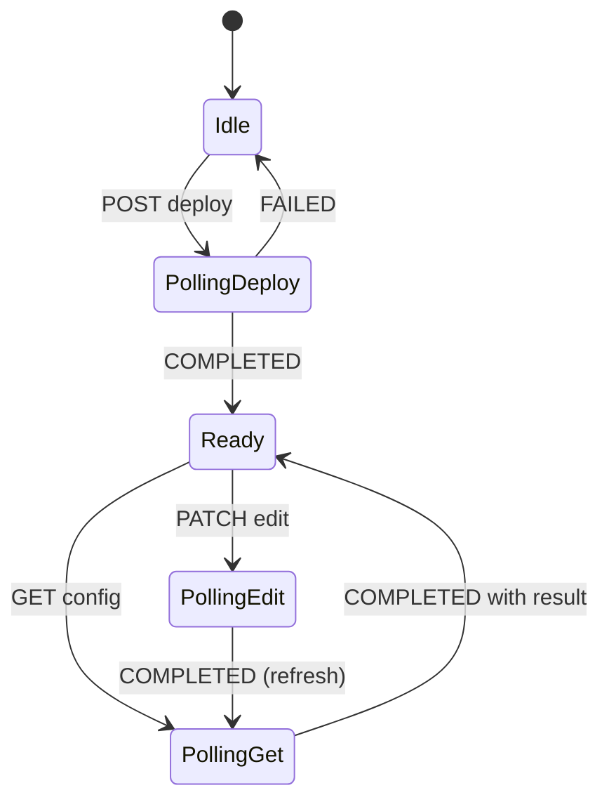

# OPC-UA Facade API — UI Developer Guide

Typed endpoints under `/api/v1/devicemgmt/devices/{device_id}/protocol-converters/opc-ua` build and parse umh-core payloads server-side. Use these for the configuration UI. Generic `/protocol-converters` remains for power users.

## Endpoints

| Action | Method | Path | Returns |
|--------|--------|------|---------|
| Deploy | `POST` | `.../protocol-converters/opc-ua` | `actionId` (workflow) |
| Edit | `PATCH` | `.../protocol-converters/opc-ua/{uuid}` | `actionId` (single action) |
| Get config | `GET` | `.../protocol-converters/opc-ua/{uuid}` | `actionId` (single action) |
| Poll typed result | `GET` | `.../protocol-converters/opc-ua/actions/{action_id}/result` | status + optional `result` |
| List inventory | `GET` | `.../protocol-converters` | catalog rows (`type`, health, deployment) |
| Delete | `DELETE` | `.../protocol-converters/{uuid}` | `actionId` |

OpenAPI: `device-management/openapi.yaml` (search `OpcUa`).

## Async flow (required)

All deploy / edit / get calls are **async**. Poll until `status` is `COMPLETED` or `FAILED`.

```
Deploy:  POST opc-ua → poll workflow actionId → optional GET for verify
Edit:    PATCH opc-ua/{uuid} → poll actionId → GET opc-ua/{uuid} (mandatory for fresh config)
Get:     GET opc-ua/{uuid} → poll actionId → result is full facade
```

Poll every 1–2s. Use `expiresAt` as a soft timeout hint.

## Poll semantics (important)

| Source | `COMPLETED` + `result` |
|--------|-------------------------|
| **GET** action | Full `OpcUaProtocolConverter` |
| **Deploy workflow** | Full facade when configure succeeded (from applied config if device reply is minimal) |
| **Edit** action | Often **no `result`** — device returns `{uuid}` only. Treat `COMPLETED` as success; **run GET** for config. |

Never assume edit poll returns YAML. Always refresh with GET before showing the form again.

## Response shape: `OpcUaProtocolConverter`

Dual-mode sections — same object for display and edit:

- `input` — `mode` + `structured` + `raw_yaml`
- `read_flow` — `processor_mode`, `buffer_mode`, structured processor, raw YAML fields
- `raw_input_yaml`, `raw_processor_yaml`, `raw_buffer_yaml` — mirrors for RAW editors
- `input_parse`, `processor_parse` — `PARSE_OK` | `PARSE_PARTIAL` | `PARSE_FAILED`
- `deployment_status`, `health_status`, `error_message` — from catalog (list + GET poll)
- `protocol`, `processing_mode`, `state`

`output` is read-only (UNS autogenerated on device).

## Section modes (edit / deploy)

When both structured and raw are present, set mode explicitly:

| Field | Values |
|-------|--------|
| `input.mode` | `STRUCTURED` \| `RAW` |
| `read_flow.processor_mode` | `STRUCTURED` \| `RAW` |
| `read_flow.buffer_mode` | `STRUCTURED` \| `RAW` |

**STRUCTURED** — server builds YAML from structured fields.  
**RAW** — server uses `raw_yaml` / `raw_processor_yaml` / `raw_buffer_yaml` verbatim.

Omitting mode when both structured and raw are set → `400`.

### Practical guidance

- **Input**: `STRUCTURED` is usually enough (node list, endpoint, subscribe flags).
- **Processor**: use `RAW` when the device has YAML-list **conditions** (`- if:` blocks) not yet editable in structured form. Otherwise structured rebuild may drop them.
- **Buffer**: either mode; `yaml_inject.raw_yaml` or `raw_buffer_yaml`.

## Deploy request

```json
{
  "device_id": "...",
  "name": "my-opcua-bridge",
  "state": "active",
  "apply_read_config": true,
  "connection": { "ip": "10.0.0.1", "port": 4840 },
  "location": { "levels": { "0": "Plant", "1": "Line1" } },
  "input": { "mode": "STRUCTURED", "structured": { ... } },
  "read_flow": { "processor_mode": "RAW", "buffer_mode": "STRUCTURED", ... },
  "template_variables": { "IP": "10.0.0.1", "PORT": "4840" }
}
```

- `name` is required; **uuid is derived from name** (deterministic, same as umh-core).
- `apply_read_config: false` → shell only (connection/location), no read pipeline.
- Poll **workflow** `actionId`, not child deploy/configure IDs.

## Edit request

```json
{
  "device_id": "...",
  "uuid": "...",
  "name": "my-opcua-bridge",
  "state": "active",
  "connection": { "ip": "...", "port": 4840 },
  "location": { "levels": { ... } },
  "input": { ... },
  "read_flow": { ... }
}
```

Typed edit is **full replace** of read config — send complete `input` + `read_flow` every time (not a partial patch).

After `COMPLETED`, run GET to reload the form.

## GET as source of truth

Use GET poll `result` to populate the UI. Structured fields are best-effort parse of device YAML:

- `tag_mappings` merges template `AddressMappings` with switch cases in `defaults_code` (switch wins for tag names).
- `PARSE_PARTIAL` — some YAML (e.g. complex conditions) may only appear in `raw_processor_yaml`; keep RAW mode available.
- `template_variables.AddressMappings` — optional; may be a subset of nodes on legacy bridges.

## List vs typed GET

| Field | List | Typed GET |
|-------|------|-----------|
| `type` | `opcua` or `protocol-converter` | `protocol` on result |
| Health / deployment | yes | yes (merged from catalog on poll) |
| Full YAML / structured | no | yes |

Filter list by `type=opcua` after first GET backfills catalog type.

## Errors

| HTTP | Meaning |
|------|---------|
| `400` | Validation (missing connection, ambiguous modes, build error) |
| `404` | Unknown action / device |
| `409` | Deploy: name already exists |
| `412` FailedPrecondition | Typed GET on non–OPC-UA bridge (after device responds) |

## UI state machine (minimal)



## Bruno examples

`device-management/bruno/03-OpcUaFacade/` — deploy, workflow poll, get, edit, action poll.

## Out of scope (use generic API or later)

- OPC-UA browse / tag discovery
- `writeDFC`
- Preview-without-deploy endpoint

## Related docs

- [`MODBUS_FACADE_UI_GUIDE.md`](./MODBUS_FACADE_UI_GUIDE.md) — Modbus typed facade
- `docs/ADR_PROTOCOL_CONVERTER_FACADE.md` — architecture
- `docs/BENTHOS_PIPELINE_MAPPING.md` — YAML field mapping
