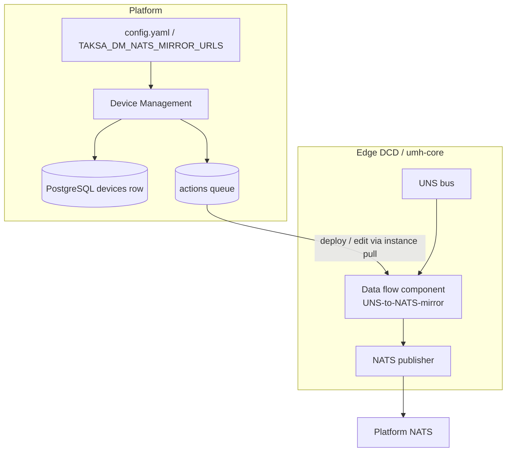
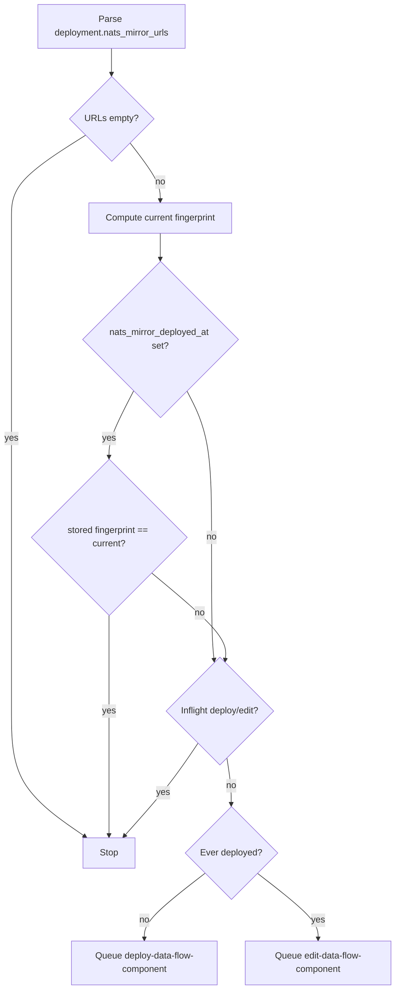

# UNS → NATS mirror (per DCD)

Device Management (DM) can automatically deploy and maintain a single **data flow component** on each edge DCD (umh-core instance) that mirrors **all** Unified Namespace (UNS) traffic to a platform NATS cluster. The mirror is **not** configured per tag or bridge: one `UNS-to-NATS-mirror` component subscribes to every UNS topic and publishes to NATS with a tenant- and device-scoped subject layout.

This document covers **design**, **implementation**, and **operations**.

---

## Goals

- Forward **all** UNS data from a DCD to NATS without creating a `dataFlow` entry per bridge or tag.
- Use a stable NATS subject prefix: `{tenant_id}.{device_id}.uns.v1.<rest>`, rewriting only the **leading** `umh.v1` segment (not every occurrence in the path).
- **Idempotent** lifecycle: first login deploys once; later logins and DM restarts update NATS URLs when platform config changes.
- **Persistent** server-side state that survives cleanup of completed rows in the `actions` table.

---

## Non-goals (current behavior)

- No public DM RPC to “force redeploy all” (fleet reconcile on startup covers config changes).
- No read-back of the DFC config from the edge to verify what NATS URLs are actually running (DM trusts successful action replies).
- Disabling mirror by clearing URLs does **not** undeploy the edge component (see [Disabling the feature](#disabling-the-feature)).
- `tenant_id` / `device_id` in subjects are the **DM device / tenant** identifiers, not PLC or protocol-converter IDs.

---

## High-level architecture



**Summary:** DM builds a Benthos-style custom DFC payload, queues `deploy-data-flow-component` or `edit-data-flow-component`, the DCD pulls the action, umh-core applies it, and DM records success on the `devices` row (timestamp + config fingerprint).

---

## Edge data flow design

### Component identity

| Field | Value |
|-------|--------|
| Name | `UNS-to-NATS-mirror` |
| Meta type | `custom` |
| State | `active` |
| UUID | Deterministic: `uuid.NewSHA1(uuid.NameSpaceDNS, []byte("UNS-to-NATS-mirror"))` (same as umh-core `GenerateUUIDFromName`) |

### Input (UNS)

- `umh_topic`: `".*"` — all UNS topics on that DCD.
- `consumer_group`: `dm_uns_nats_mirror_<device_id>` (hyphens stripped from device ID) — one consumer group per device.

### Output (NATS)

- `urls`: from platform config (comma-separated list).
- `subject`: Bloblang expression:

  ```
  {tenant_id}.{device_id}.${! meta("umh_topic").re_replace("^umh\\.v1", "uns.v1") }
  ```

  Example: UNS topic `umh.v1.plant.line1.temperature` → NATS subject  
  `{tenant}.{device}.uns.v1.plant.line1.temperature`.

- `max_reconnects`: `-1`

### Pipeline

Minimal identity mapping (`root = this`) to satisfy umh-core validation.

New bridges and tags on the DCD are picked up automatically because the mirror reads from UNS, not from per-resource `dataFlow` definitions.

---

## Platform configuration

| Source | Key | Notes |
|--------|-----|--------|
| `configs/config.yaml` | `deployment.nats_mirror_urls` | Comma-separated NATS URLs, e.g. `nats://nats1:4222,nats://nats2:4222` |
| Environment | `TAKSA_DM_NATS_MIRROR_URLS` | Overrides `deployment.nats_mirror_urls` when **non-empty** (`applyConfigEnvOverrides` in `main.go`) |
| Proto | `conf.Deployment.nats_mirror_urls` | `internal/conf/conf.proto` |

**Empty URLs** → mirror logic is a no-op (no deploy, no edit, no fleet reconcile).

---

## Server-side persistence (not on the DCD)

DM stores bookkeeping on each **device row** in PostgreSQL. The DCD only stores the operational DFC (including real NATS URLs inside umh-core config).

| Column | Meaning |
|--------|---------|
| `nats_mirror_deployed_at` | Set when a deploy or edit action **succeeded** at least once; `NULL` = never successfully applied |
| `nats_mirror_config_fingerprint` | SHA-256 hex of the **sorted, comma-joined** URL list DM last recorded as applied |

The fingerprint is **not** sent to the edge. It lets DM detect “platform config changed since we last pushed to this device” without reading DFC state back from umh-core.

Migrations:

| Migration | Adds |
|-----------|------|
| `002_nats_mirror_device.up.sql` | `nats_mirror_deployed_at` |
| `003_nats_mirror_config_fingerprint.up.sql` | `nats_mirror_config_fingerprint` |

See `db/migrations/README.md` for the full list.

---

## Control flow

### When mirror is ensured

1. **Device login** — `InstanceUsecase.Login` calls `EnsureUNSToNATSMirror` after `EnsureStatusSubscription` (`internal/biz/instance.go`).
2. **DM startup** — Kratos `BeforeStart` calls `StartNATSMirrorFleetReconcile(ctx)`, which runs `ReconcileNATSMirrorFleet` once ~3s later (cancellable via `AfterStop` on shutdown).

### Decision logic (`ensureNATSMirrorForDevice`)



**Inflight** = row in `actions` for this tenant/device with type `deploy-data-flow-component` or `edit-data-flow-component`, JSON payload with top-level **`"name": "UNS-to-NATS-mirror"`** (`payload_data::jsonb ->> 'name'`), and status `QUEUED`, `DELIVERED`, or `PROCESSING` (`internal/storage/postgres/action.go`). Mirror actions are **excluded** from `TAKSA_DM_ACTION_AUTO_EXPIRE_MINUTES`; see [ACTION_MANAGEMENT.md](./ACTION_MANAGEMENT.md).

### Success handling

When the instance service correlates a **successful** action reply (`correlateResponseByTraceId` / `correlateResponseByActionUUID`), `RecordNATSMirrorDeploySuccess` runs for deploy or edit actions and calls `SetNATSMirrorApplied` with the **current** deployment fingerprint (`internal/biz/nats_mirror.go`).

Failed actions do not update the device row, except:

- **Edit failed with “not found”** (DFC removed on the edge while DM still has `nats_mirror_deployed_at`): `HandleNATSMirrorActionFailure` clears `nats_mirror_deployed_at` and `nats_mirror_config_fingerprint`, then queues **`deploy-data-flow-component`** immediately (same push correlation path as success).

Other edit failures still require manual intervention or a later login/reconcile.

---

## umh-core action contract

| Phase | Action type | Payload shape |
|-------|-------------|----------------|
| First deploy | `deploy-data-flow-component` | `name`, `meta`, `state`, `payload.customDataFlowComponent` |
| URL / config update | `edit-data-flow-component` | Same + top-level `uuid` (deterministic component UUID) |

Action types use **kebab-case** to match umh-core models (not snake_case).

Queued payload is wrapped in `google.protobuf.Any` with type URL `type.googleapis.com/taksa.edge.NATSMirrorDeployPayload`; umh-core consumes the raw JSON bytes.

Payload construction: `internal/biz/nats_mirror.go` (`buildNATSMirrorDeployActionPayload`, `buildNATSMirrorEditActionPayload`).

Unit tests: `internal/biz/nats_mirror_test.go`.

---

## Usage

### Enable mirror for new devices

1. Set NATS URLs in `.env` or `configs/config.yaml`:

   ```bash
   TAKSA_DM_NATS_MIRROR_URLS=nats://nats.platform.example:4222
   ```

2. Apply DB migrations `002` and `003` on the DM database.

3. Start or restart device-management.

4. When a DCD **logs in**, DM queues `deploy-data-flow-component` for `UNS-to-NATS-mirror` if not already deployed and no inflight action exists.

5. After the edge reports success, verify NATS subjects under `{tenant_id}.{device_id}.uns.v1.*`.

### Change NATS URLs (existing fleet)

1. Update `TAKSA_DM_NATS_MIRROR_URLS` (or `deployment.nats_mirror_urls`).

2. Restart DM.

3. **Fleet reconcile** (~3s after startup) queues deploy or edit for every device where:
   - `nats_mirror_deployed_at IS NULL` (never successfully applied), or
   - `nats_mirror_config_fingerprint` is `NULL` or differs from the current hash.

4. Online devices pick up actions on pull; offline devices update on **next login** (same `ensureNATSMirrorForDevice` logic).

5. After each successful edit, DM updates `nats_mirror_config_fingerprint` on that device row.

Devices deployed **before** migration `003` have `NULL` fingerprint and are treated as needing one update after the first restart with new code.

### Disabling the feature

Setting URLs to empty stops **new** deploys and edits. It does **not** remove `UNS-to-NATS-mirror` from devices that already have it. To tear down on the edge, use umh-core / DM delete-data-flow-component flows separately (not automated by this feature today).

**Note:** `TAKSA_DM_NATS_MIRROR_URLS` only overrides when non-empty; YAML `deployment.nats_mirror_urls` applies when the env var is unset or empty.

---

## Operations checklist

| Step | Action |
|------|--------|
| Schema | Run `002_nats_mirror_device.up.sql` and `003_nats_mirror_config_fingerprint.up.sql` |
| Config | Set comma-separated NATS URLs |
| Deploy DM | Restart after URL change |
| Verify one device | Login DCD → check `actions` completes → confirm NATS traffic on expected subjects |
| Verify fleet | Query devices with stale fingerprint (see below) |

### Useful SQL

```sql
-- Devices that still need a config push after URL change
SELECT id, tenant_id, nats_mirror_deployed_at, nats_mirror_config_fingerprint
FROM devices
WHERE nats_mirror_deployed_at IS NOT NULL
  AND (nats_mirror_config_fingerprint IS NULL
       OR nats_mirror_config_fingerprint <> '<current_sha256_hex>');

-- Mirror never successfully applied
SELECT id, tenant_id FROM devices WHERE nats_mirror_deployed_at IS NULL;
```

Compute `<current_sha256_hex>` the same way as DM: sort URLs, join with `,`, SHA-256, hex-encode (`NATSMirrorConfigFingerprint` in `internal/biz/nats_mirror.go`).

### Inflight / stuck actions

Check `actions` for the device with `action_type` in (`deploy-data-flow-component`, `edit-data-flow-component`) and `payload_data::jsonb ->> 'name' = 'UNS-to-NATS-mirror'`. Status `1`/`2` block duplicate queueing until the action completes or is cleaned up.

---

## Implementation index

| Area | Location |
|------|----------|
| Core logic | `internal/biz/nats_mirror.go` |
| Login hook | `internal/biz/instance.go` (`EnsureUNSToNATSMirror`) |
| Action success | `internal/biz/instance.go` (`RecordNATSMirrorDeploySuccess`) |
| Device store API | `internal/storage/device.go` |
| Postgres | `internal/storage/postgres/device.go`, `internal/storage/postgres/action.go` |
| Deployment proto | `internal/conf/conf.proto` |
| Startup reconcile | `cmd/device-management/main.go` (`newApp` → `StartNATSMirrorFleetReconcile`) |
| Tests | `internal/biz/nats_mirror_test.go` |
| DDL | `db/schema.postgres.sql` (`devices` columns) |

---

## Consumer mental model

1. **Platform config** defines which NATS cluster all mirrored DCDs should use.
2. **Per-device DB columns** record what DM last successfully pushed (timestamp + URL-set fingerprint).
3. **The DCD** holds the live DFC; DM updates it via the standard action queue, not a separate edge API.
4. **Config changes** propagate via startup fleet reconcile and per-login ensure, using **edit** when the component already exists.
5. **Subject layout** is fixed per tenant/device; only NATS `urls` (and the same subject template) change when you rotate brokers.

---

## Related documentation

- Topic catalog (separate feature, also driven by status): `docs/TOPIC_BROWSER.md`
- Action types in API surface: `api/devicemgmt/v1/devicemgmt.proto` (data flow component deploy/edit)
